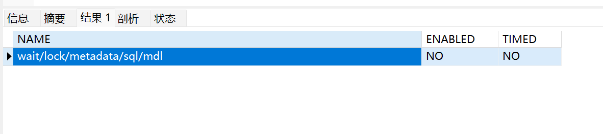

# MDL锁

## 参考
- https://opensource.actionsky.com/20220426-mysql/

## 查看MDL是否开启
```sql
select * from performance_schema.setup_instruments WHERE `NAME`='wait/lock/metadata/sql/mdl';
```


## 开启|关闭mdl锁
```sql
update performance_schema.setup_instruments set enabled='NO',TIMED='NO' where name='wait/lock/metadata/sql/mdl';
update performance_schema.setup_instruments set enabled='YES',TIMED='YES' where name='wait/lock/metadata/sql/mdl';
```

## 查看当前操作锁状态
```sql
select m.*, t.* from performance_schema.metadata_locks m left join performance_schema.threads t on m.owner_thread_id = t.thread_id;
```

## 实验操作
### 1、SELECT SLEEP(1000) FROM t_simple;
```text
*************************** 3. row ***************************
          OBJECT_TYPE: TABLE
        OBJECT_SCHEMA: dsz
          OBJECT_NAME: t_simple
OBJECT_INSTANCE_BEGIN: 139815279348608
            LOCK_TYPE: SHARED_READ
        LOCK_DURATION: TRANSACTION
          LOCK_STATUS: GRANTED
               SOURCE: 
      OWNER_THREAD_ID: 1505
       OWNER_EVENT_ID: 7
            THREAD_ID: 1505
                 NAME: thread/sql/one_connection
                 TYPE: FOREGROUND
       PROCESSLIST_ID: 1479
     PROCESSLIST_USER: root
     PROCESSLIST_HOST: 192.168.10.34
       PROCESSLIST_DB: dsz
  PROCESSLIST_COMMAND: Query
     PROCESSLIST_TIME: 6
    PROCESSLIST_STATE: User sleep
     PROCESSLIST_INFO: SELECT SLEEP(1000) FROM t_simple
     PARENT_THREAD_ID: NULL
                 ROLE: NULL
         INSTRUMENTED: YES
              HISTORY: YES
      CONNECTION_TYPE: TCP/IP
         THREAD_OS_ID: 141
```
## MDL锁超时
```sql
SHOW VARIABLES LIKE '%lock_wait_timeout%';
```
```text
innodb_lock_wait_timeout	50        #innodb锁等待
lock_wait_timeout	        31536000  # mdl锁等待
```

## METADATA LOCK 的源头
### 模拟锁等待
- 上排他锁
```sql
BEGIN;
SELECT * FROM t_simple WHERE id = 6 FOR UPDATE;
COMMIT;
```
- alert竞争排他锁
```sql
alter table t_simple add name varchar(10);
```
- 查看MDL锁数据
```sql
SELECT
    locked_schema,
    locked_table,
    locked_type,
    waiting_processlist_id,
    waiting_age,
    waiting_query,
    waiting_state,
    blocking_processlist_id,
    blocking_age,
    substring_index(sql_text,"transaction_begin;" ,-1) AS blocking_query,
    sql_kill_blocking_connection
FROM
    (
        SELECT
            b.OWNER_THREAD_ID AS granted_thread_id,
            a.OBJECT_SCHEMA AS locked_schema,
            a.OBJECT_NAME AS locked_table,
            "Metadata Lock" AS locked_type,
            c.PROCESSLIST_ID AS waiting_processlist_id,
            c.PROCESSLIST_TIME AS waiting_age,
            c.PROCESSLIST_INFO AS waiting_query,
            c.PROCESSLIST_STATE AS waiting_state,
            d.PROCESSLIST_ID AS blocking_processlist_id,
            d.PROCESSLIST_TIME AS blocking_age,
            d.PROCESSLIST_INFO AS blocking_query,
            concat('KILL ', d.PROCESSLIST_ID) AS sql_kill_blocking_connection
        FROM
            performance_schema.metadata_locks a
        JOIN performance_schema.metadata_locks b ON a.OBJECT_SCHEMA = b.OBJECT_SCHEMA
        AND a.OBJECT_NAME = b.OBJECT_NAME
        AND a.lock_status = 'PENDING'
        AND b.lock_status = 'GRANTED'
        AND a.OWNER_THREAD_ID <> b.OWNER_THREAD_ID
        AND a.lock_type = 'EXCLUSIVE'
        JOIN performance_schema.threads c ON a.OWNER_THREAD_ID = c.THREAD_ID
        JOIN performance_schema.threads d ON b.OWNER_THREAD_ID = d.THREAD_ID
    ) t1,
    (
        SELECT
            thread_id,
            group_concat(   CASE WHEN EVENT_NAME = 'statement/sql/begin' 
                                                         THEN "transaction_begin" 
                                                         ELSE sql_text 
                                                         END 
                                                         ORDER BY event_id SEPARATOR ";" ) AS sql_text
        FROM
           performance_schema.events_statements_history
        GROUP BY thread_id
    ) t2
WHERE
      t1.granted_thread_id = t2.thread_id ;
```
- 展示锁等待
```text
*************************** 1. row ***************************
               locked_schema: dsz
                locked_table: t_simple
                 locked_type: Metadata Lock
      waiting_processlist_id: 1489
                 waiting_age: 39
               waiting_query: alter table t_simple add name varchar(10)
               waiting_state: Waiting for table metadata lock
     blocking_processlist_id: 1486
                blocking_age: 68
              blocking_query: SELECT * FROM t_simple WHERE id = 6 FOR UPDATE;SHOW STATUS;SELECT QUERY_ID, SUM(DURATION) AS SUM_DURATION FROM INFORMATION_SCHEMA.PROFILING GROUP BY QUERY_ID;SELECT STATE AS `Status`, ROUND(SUM(DURATION),7) AS `Duration`, CONCAT(ROUND(SUM(DURATION)/0.001757*100,3), '') AS `Percentage` FROM INFORMATION_SCHEMA.PROFILING WHERE QUERY_ID=2 GROUP BY SEQ, STATE ORDER BY SEQ
sql_kill_blocking_connection: KILL 1486
1 row in set, 5 warnings (0.01 sec)
```