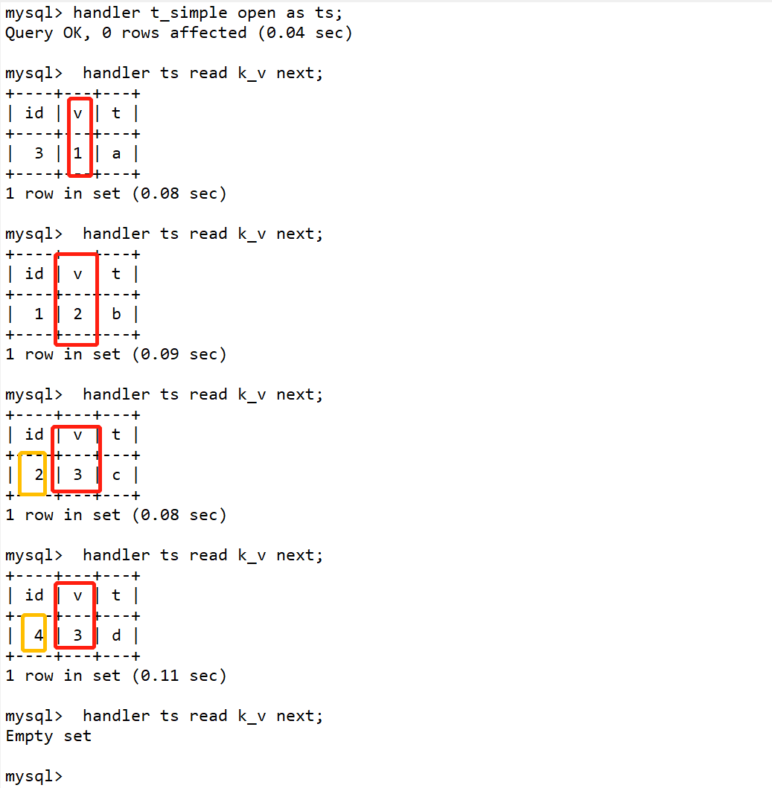

# 二级索引排序验证

## 官网
```text
https://dev.mysql.com/doc/refman/8.0/en/index-extensions.html
https://coderbee.net/index.php/db/20190106/1708
```

## 开启扩展索引
```sql
SET optimizer_switch = 'use_index_extensions=on/off';
```

## 是否开启扩展索引
```sql
show variables like '%optimizer_switch%'; 
```
```text
use_index_extensions=on, #开启了扩展索引
index_merge=on,index_merge_union=on,
index_merge_sort_union=on,index_merge_intersection=on,
engine_condition_pushdown=on,index_condition_pushdown=on,
mrr=on,mrr_cost_based=on,block_nested_loop=on,batched_key_access=off,
materialization=on,semijoin=on,loosescan=on,firstmatch=on,duplicateweedout=on,
subquery_materialization_cost_based=on,condition_fanout_filter=on,
derived_merge=on,prefer_ordering_index=on
```

## 实验
```sql
create table t_simple (
    id int primary key,
    v int,
	t VARCHAR(20),
    KEY k_v (v),
	KEY k_t(t)
) ENGINE=InnoDB DEFAULT CHARSET=utf8mb4;
```
## handler语法
```sql
handler table_name/table_name_alias read index_name first/pre/next/last;
```
## 效果



## 扩展索引的好处
```text
InnoDB 自动扩展每个二级索引，把主键值追加到索引列后面，把扩展后的组合列作为该索引的索引列。对于上面 t_simple 表的 k_v 索引，扩展后是 (v, id)列。
优化器会根据扩展后的二级索引的主键列来决定如何和是否使用那个索引。
优化器可以用扩展的二级索引来进行 ref,range,index_merge 等类型的索引访问、松散的索引扫描、连接和排序优化，以及 min()/max() 优化。
```