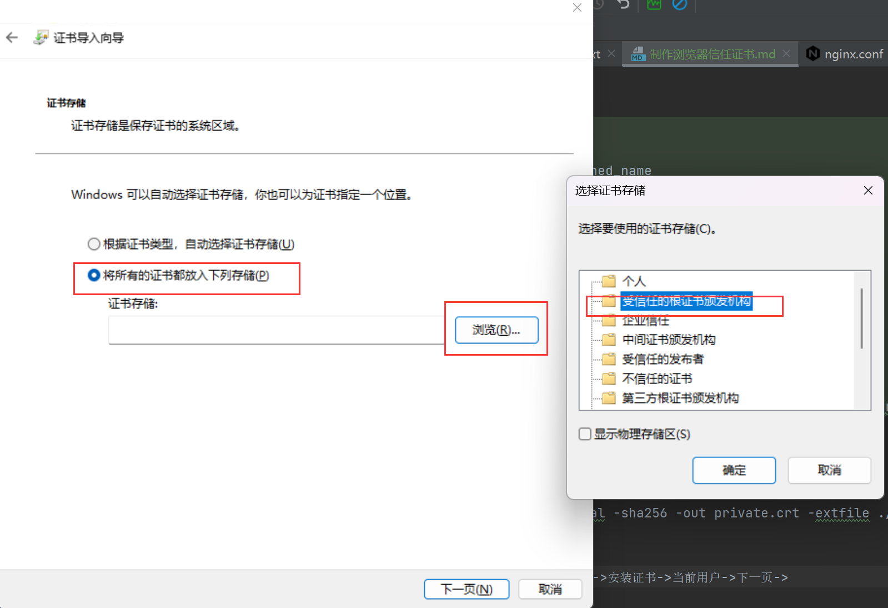

# 生成根证书

```shell
openssl req -x509 -nodes -days 3650 -newkey rsa:2048 \
-subj "/C=CN/ST=SiChuan/L=ChengDu/O=ACS" -keyout CA-private.key \
-out CA-certificate.crt -reqexts v3_req -extensions v3_ca
```


# 生成服务端证书
```shell
openssl genrsa -out private.key 2048
openssl req -new -key private.key -subj "/C=CN/ST=SiChuan/L=ChengDu/O=ACS/CN=192.168.10.33" -sha256 -out private.csr
```


# 生成扩展文件
## vim private.ext
```text
[ req ]
default_bits = 1024
distinguished_name = req_distinguished_name
req_extensions = san
extensions = san
[ req_distinguished_name ]
countryName = CN
stateOrProvinceName = Definesys
localityName = Definesys
organizationName = Definesys
[SAN]
authorityKeyIdentifier=keyid,issuer
basicConstraints=CA:FALSE
keyUsage = digitalSignature, nonRepudiation, keyEncipherment, dataEncipherment
subjectAltName = IP:192.168.10.33
```
# 扩展操作
openssl x509 -req -days 3650 -in private.csr -CA CA-certificate.crt \
-CAkey CA-private.key -CAcreateserial -sha256 -out private.crt -extfile ./private.ext -extensions SAN

# 浏览器导入证书
将CA-certificate.crt文件下载到桌面，双击->安装证书->当前用户->下一页->
